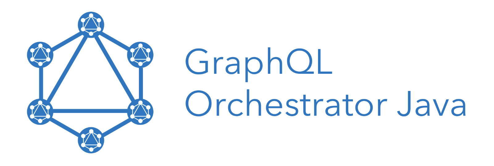

<div align="center">

  

</div>

[Builds](https://circleci.com/gh/intuit/graphql-orchestrator-java)


**graphql-orchestrator-java** is a library that exposes data from various GraphQL microservices using a single unified GraphQL schema.
It uses [a recursive strategy](./mkdocs/docs/key-concepts/merging-types.md) to aggregate and combine the schemas from these micro-services 
and [orchestrates the graphql queries](./mkdocs/docs/key-concepts/graphql-query-execution.md) to the appropriate services
at runtime.


It uses the [graphql-java](https://github.com/graphql-java/graphql-java) library as the runtime execution engine on the unified schema.

## Getting Started

### Dependency

```xml
<dependency>
    <groupId>com.intuit.graphql</groupId>
    <artifactId>graphql-orchestrator-java</artifactId>
    <version>${graphql.orchestrator.version}</version>
</dependency>
```

### Usage in code

* Implement the ServiceProvider interface. You will a new instance for
each GraphQL Service.
```java
class TemplateServiceProvider implements ServiceProvider {

  public static final String TEMPLATE = "type Query { nested: Nested } type Nested { %s: String}";
  private String field;

  public TemplateServiceProvider(String field) { this.field = field; }

  // Unique namespace for the service
  @Override
  public String getNameSpace() { return field; }

  // GraphQL Schema
  @Override
  public Map<String, String> sdlFiles() {
    return ImmutableMap.of(field + ".graphqls", String.format(TEMPLATE, field));
  }

  // Query execution at runtime, the response needs to have data and error objects as per GraphQL Spec
  @Override
  public CompletableFuture<Map<String, Object>> query(final ExecutionInput executionInput, 
      final GraphQLContext context) {
    //{'data':{'nested':{'%s':'%s'}}}"
    Map<String, Object> data = ImmutableMap
        .of("data", ImmutableMap.of("nested", ImmutableMap.of(field, field)));
    return CompletableFuture.completedFuture(data);
  }
}
```

* Create an instance of Orchestrator and execute the query as below.
```java
    // create a runtimeGraph by stitching service providers
    RuntimeGraph runtimeGraph = SchemaStitcher.newBuilder()
        .service(new TemplateServiceProvider("foo"))   
        .service(new TemplateServiceProvider("bar"))  
        .build()
        .stitchGraph();

    // pass the runtime graph to GraphQLOrchestrator
    GraphQLOrchestrator graphQLOrchestrator = GraphQLOrchestrator.newOrchestrator()
        .runtimeGraph(runtimeGraph).build();
    
    //Execute the query 
    CompletableFuture<ExecutionResult> execute = graphQLOrchestrator
        .execute(ExecutionInput.newExecutionInput().query("query {nested {foo bar}}").build());

    ExecutionResult executionResult = execute.get();
    System.out.println(executionResult.getData().toString());
    // Output: {nested={foo=foo, bar=bar}}
```

------------------------------

### Documentation

Detailed [Documentation](https://intuit.github.io/graphql-orchestrator-java/) can be found here

### Contributing

Read the [Contribution guide](./.github/CONTRIBUTING.md)

