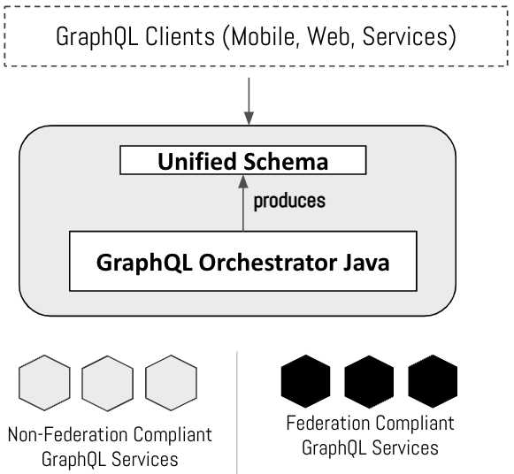

# GraphQL Orchestrator

##Introduction

Unlike REST, GraphQL follows a single endpoint model wherein, the client is expected to call one endpoint to get all its data.
A large organization typically consists of numerous microservices that are owned by different teams. This leads to a need for 
a GraphQL orchestrator that provides a single graphql endpoint orchestrating data across multiple graphql providers.

**GraphQL Orchestrator** is a library that exposes data from various data providers using a single unified GraphQL schema. 
It aggregates and combines the schemas from these data providers and orchestrates the incoming graphql queries to the appropriate services.
It uses the [graphql-java](https://github.com/graphql-java/graphql-java) library as the runtime execution engine on the unified schema. 

It provides the following features 

* [Recursive schema stitching](./key-concepts/merging-types/#recursive-merging)
* [Parallel network calls to Data Providers](key-concepts/graphql-query-execution)
* [Batching queries](key-concepts/graphql-query-execution/#batching-queries) 

------------------------------
(c) Copyright 2021 Intuit Inc.

